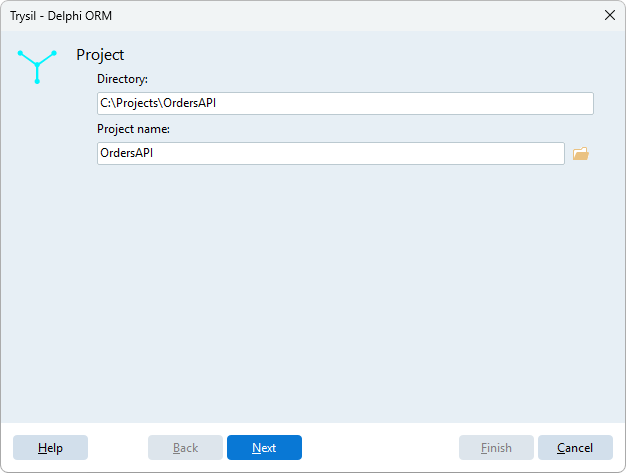
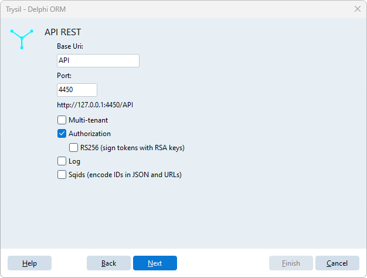

# Create new Trysil API REST

**Trysil > Create new Trysil API REST** creates a complete REST API server project built on Trysil, ready to compile, and opens it in the IDE. The command is available only when no project is open: close the current project group first.

The project comes from the [TApiRest](https://github.com/TTContext/TApiRest) template, which the Expert downloads from GitHub at the moment you click **Finish**, so an internet connection is required. The Expert keeps the parts of the template that belong to the features you choose and removes the others, so the generated code contains only what you asked for.

One executable runs as a Windows service, as a tray application when started with `/debug`, and as a console application on Linux.

## The wizard

The wizard has five pages; **Next** checks the current page before moving on.

### Project



| Field | Meaning |
|---|---|
| Directory | Folder of the new project, as a full path (for example `C:\Dev\MyApi`). It must be empty or not exist yet |
| Project name | Name of the `.dproj` and prefix of the project units |

The button next to **Project name** picks both with a save dialog.

### API REST



| Field | Meaning |
|---|---|
| Base Uri | Path prefix of every route, for example `/api` |
| Port | TCP port the server listens on. The label below shows the resulting URL |
| Multi-tenant | One database per tenant, chosen from the `Host` header of the request |
| Authorization | Login, JWT tokens and the `/auth` endpoints |
| RS256 (sign tokens with RSA keys) | Signs the tokens with an RSA key pair instead of a shared secret. Available with **Authorization** only |
| Log | Logs requests, responses and actions to a log database |
| Sqids (encode IDs in JSON and URLs) | Primary and foreign keys travel as short opaque strings, in the JSON and in the route parameters, instead of sequential numbers. The database keeps the integer IDs. Requires Delphi 12 Athens or later: on older versions the box is disabled and the note *Feature not supported by this Delphi version* appears below it |

See [Multi-Tenant](../../http/multi-tenant.md) and [Authentication](../../http/authentication.md) for what these features do at runtime.

### Database

The connection of the application: database type, host, port, user name, password and database name. With **Multi-tenant** the page is titled *Tenant (localhost) database* and configures the first tenant, the one answering on `localhost`.

Host, user name and password are not used by SQLite; the port is used only by MariaDB, Oracle and PostgreSQL.

### HTTP Log database

Shown only when **Log** is ticked: the connection of the log database, with the same fields.

### Service

| Field | Meaning |
|---|---|
| Name | Name of the Windows service. It must differ from the project name |
| Description | Description of the Windows service. Default `<Project name> - API REST` |

Click **Finish**: the Expert downloads the template, generates the project and opens it.

## What is generated

```
MyApi\
  MyApi.dproj
  MyApi.dpr
  MyApi.*.pas               project units
  Core\                     TApiRest.* base units, the same in every project
  SQL\                      scripts of the tables used by Authorization and Log
  _Config\
    MyApi.json              server, database, log and secrets
    Tenants\
      localhost-4450\
        _config.json        first tenant (Multi-tenant only)
  __trysil\                 entity model of the Expert
```

The Expert fills the configuration with what you entered in the wizard:

- `_Config\<Project>.json` gets the base URI, the port and, with **Authorization**, new random secrets for passwords and tokens; without **Multi-tenant** it also gets the database connections;
- with **Multi-tenant**, the connections go to the tenant instead: its folder is named `localhost-<port>` and its `_config.json` gets the database connections;
- the project settings of the Expert get the database type, so that [Generate DDL script](generate-sql.md) starts with the right one.

!!! warning "RS256 keys"
    With **RS256** the configuration points to `keys\private.pem` and `keys\public.pem`. The Expert does not create the keys: generate an RSA key pair and put the two PEM files there before starting the server.

!!! warning "Secrets in the configuration"
    `_Config\<Project>.json` contains database passwords and token secrets. Keep it out of public repositories.

## Next steps

The generated project already has the entity model of its own tables (for example the users, with **Authorization**) in `__trysil`. To add your entities:

1. [Design entity model](design.md) to add them;
2. [Generate DDL script](generate-sql.md) to create the tables;
3. [Generate entity model](generate-model.md) with **Generate & register API REST controllers** ticked: each entity gets a read/write controller, registered in the server.
