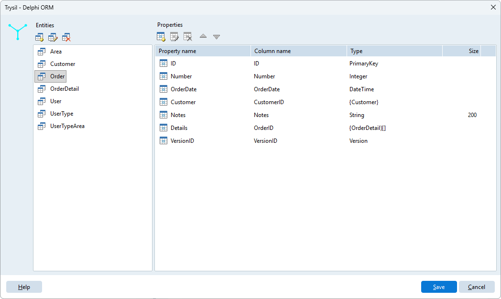
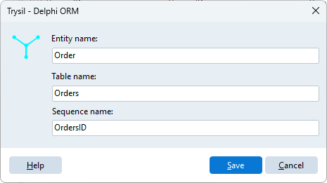
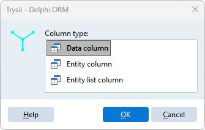
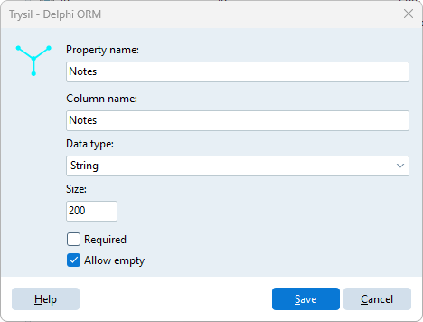
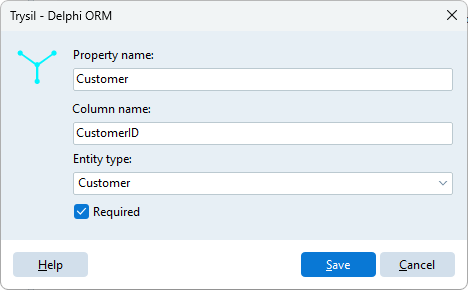

# Design entity model

**Trysil > Design entity model** opens the designer of the active project. The left panel lists the **entities**, the right panel the **properties** (columns) of the selected entity.

Nothing is written to disk until you click **Save**. **Cancel** discards every change made since the designer was opened.

## Entities

Use the buttons above the entity list:

| Button | Action |
|---|---|
| Add new entity | Creates an entity |
| Edit entity | Changes name, table and sequence (also with a double click) |
| Delete entity | Removes the entity, after confirmation |

The entity dialog has three fields:

| Field | Meaning | Generated as |
|---|---|---|
| Entity name | Name of the Delphi class, without the `T` prefix | `TCustomer` |
| Table name | Database table | `[TTable('Customers')]` |
| Sequence name | Sequence that generates the primary key | `[TSequence('CustomersID')]` |

While you type, the Expert suggests the table name from the entity name and the sequence name from the table name, followed by `ID`. A suggestion follows the field it comes from until you change it by hand.

The dialog refuses empty fields, a table named like its own sequence, and names already used by another entity: two entities cannot share the entity name, the table name or the sequence name, and a table cannot have the name of another entity's sequence. Names are compared ignoring case.

Every new entity starts with two columns that cannot be edited, moved or deleted:

| Property | Column | Type |
|---|---|---|
| `ID` | `ID` | Primary key, `TTPrimaryKey` |
| `VersionID` | `VersionID` | Version for optimistic locking, `TTVersion` |

`ID` is always the first column, `VersionID` always the last.

## Properties

Use the buttons above the property list:

| Button | Shortcut | Action |
|---|---|---|
| Add new property | | Asks the column type, then opens its dialog |
| Edit property | double click | Changes the selected property |
| Delete property | | Removes the property, after confirmation |
| Move property up | Ctrl+Up | Moves the property one place up |
| Move property down | Ctrl+Down | Moves the property one place down |

The order of the properties is the order of the fields in the generated class and of the columns in the CREATE TABLE.

When you add a property, the Expert asks what kind of column it is:

| Column type | What it is |
|---|---|
| Data column | A value: text, number, date, and so on |
| Entity column | A reference to another entity (a foreign key), loaded lazily |
| Entity list column | The list of the entities that refer to this one (a detail list), loaded lazily |

### Data column

| Field | Meaning |
|---|---|
| Property name | Name of the Delphi field and property |
| Column name | Database column; suggested from the property name |
| Data type | See the table below |
| Size | Maximum length, for `String` only, and mandatory for it |
| Required | The column is `NOT NULL` and the field gets `[TRequired]` |
| Allow empty | For a `String` that is not required: see below |

| Data type | Delphi type |
|---|---|
| String | `String`, with `[TMaxLength(Size)]` |
| Memo | `String`, unlimited text |
| Smallint | `Smallint` |
| Integer | `Integer` |
| LargeInteger | `Int64` |
| Double | `Double` |
| Currency | `Currency` |
| Boolean | `Boolean` |
| DateTime | `TDateTime` |
| Guid | `TGuid` |
| Blob | `TBytes` |

A column that is **not required** is generated as [`TTNullable<T>`](../../guide/nullable.md), for example `TTNullable<Integer>`, so that it can hold `NULL`.

**Allow empty** is the exception for text. A `String` column that is not required but allows empty is generated as a plain `String`, and its database column gets `DEFAULT ''`: the value is never `NULL`, at most an empty string.

### Entity column

An entity column is a reference to another entity of the model, like the customer of an order.

| Field | Meaning |
|---|---|
| Property name | Name of the property, for example `Customer` |
| Column name | Database column with the foreign key; suggested as the property name followed by `ID`, for example `CustomerID` |
| Entity type | The entity referred to |
| Required | The reference cannot be empty |

It is generated as a [`TTLazy<T>`](../../guide/lazy-loading.md) field with a property of the entity type, so the related entity is loaded the first time you read it. In the database it is an integer column.

### Entity list column

An entity list column is the other side of a reference: the rows of an order.

| Field | Meaning |
|---|---|
| Property name | Name of the property, for example `Details` |
| Entity type | The entity of the list, for example `OrderDetail` |
| Column name | The column of that entity that refers to this one, for example `OrderID` |

It is generated as a `TTLazyList<T>` field, with a read-only property of type `TTList<T>`. It has no column of its own in the database: the list is read through the column of the other entity, and the Expert adds an index on that column to the DDL script.

!!! tip
    Create the entities first, then the reference columns: the entity type lists only entities that already exist. For an entity list column, the column name lists the Integer data columns of the chosen entity, so the column on the other side must already be there.

!!! warning "No entity column back to the master"
    In the detail entity, the column that refers to the master is a plain **Integer** data column, like `OrderID` in `OrderDetail`. Do not add to the detail an entity column that points back to the master: the unit of the master uses the unit of the detail for the list, the unit of the detail would use the unit of the master for the reference, and Delphi does not compile two units that use each other in their interface.

## Relations

The Expert derives the `[TRelation]` attributes from the reference columns, so that Trysil checks related rows on delete:

- an **entity column** on `Order` that refers to `Customer` adds to `TCustomer` a relation on `Orders.CustomerID`, without cascade: a customer with orders cannot be deleted;
- an **entity list column** `Details` on `Order` adds to `TOrder` a relation on the table of `OrderDetail` and its column `OrderID`, with cascade: deleting an order deletes its rows.

The Expert does not generate foreign key constraints in the database.
