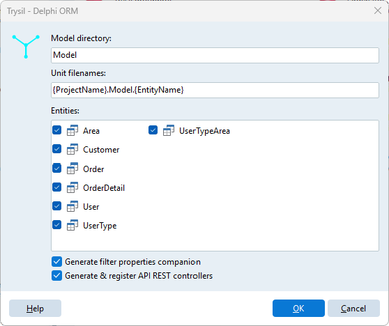
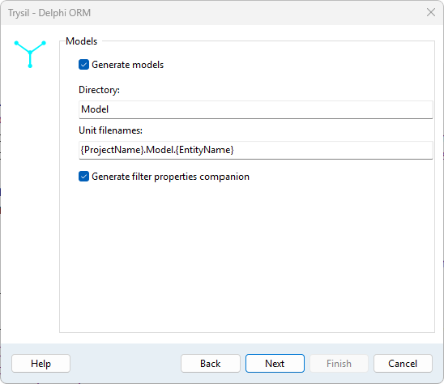
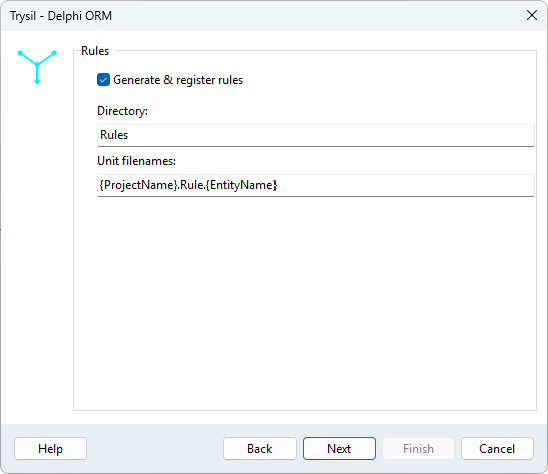
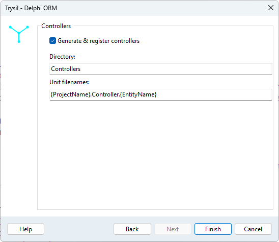

# Generate entity model

**Trysil > Generate entity model** writes Delphi units for the entities of the model and adds them to the active project: the entity classes, the [rules units](#rules-units) and, in an API REST project, the [controllers](#api-rest-controllers).

## The wizard

The dialog is a wizard of four pages: **Back** and **Next** move between them, **Finish** generates. The directories and unit filenames you choose are remembered for the project in `__trysil\__settings\settings.json`, and their defaults come from [Settings](settings.md). The check boxes are not remembered: every time the wizard opens, models, filter properties and controllers are ticked and rules are not.

### Entities



The entities to generate, all ticked by default. Right click for **Select all entities** / **Unselect all entities**. **Next** asks for at least one.

### Models



| Field | Default | Meaning |
|---|---|---|
| Generate models | Ticked | Writes the entity units |
| Directory | `Model` | Folder of the units, relative to the project folder |
| Unit filenames | `{ProjectName}.Model.{EntityName}` | Pattern of the unit names |
| Generate filter properties companion | Ticked | Adds a `T<Entity>Properties` record to each unit |

**Unit filenames** is used even with **Generate models** not ticked: the rules and controller units name the model unit in their `uses` clause.

### Rules



| Field | Default | Meaning |
|---|---|---|
| Generate & register rules | Not ticked | Writes a [rules unit](#rules-units) for each entity that has none yet |
| Directory | `Rules` | Folder of the units, relative to the project folder |
| Unit filenames | `{ProjectName}.Rule.{EntityName}` | Pattern of the unit names |

### Controllers



Shown only in a project created by the [API REST wizard](api-rest.md); in any other project the wizard skips it and **Finish** is on the Rules page.

| Field | Default | Meaning |
|---|---|---|
| Generate & register controllers | Ticked | Writes and registers the [controllers](#api-rest-controllers) |
| Directory | `Controllers` | Folder of the units, relative to the project folder |
| Unit filenames | `{ProjectName}.Controller.{EntityName}` | Pattern of the unit names |

### Finish

At least one of models, rules and controllers has to be ticked. Each can be generated on its own: the rules or the controllers of entities whose model units are already there, for instance.

The unit name patterns accept two placeholders, ignoring case: `{ProjectName}`, the name of the `.dproj` without extension, and `{EntityName}`. For the project `OrdersAPI` and the entity `Order` the default gives `OrdersAPI.Model.Order`. Nested folders are allowed in the directories, for example `Source/Model`, and are created when missing.

If a model or controller unit with the same name is already in the project, the Expert lists the units that would be overwritten and asks before continuing. Rules units are never overwritten.

## What is generated

Each unit contains the entity class with its Trysil attributes, and the getters and setters of the lazy properties. The units are opened in the editor and added to the project: save them as you would any new unit.

For an `Order` entity with an order date, a customer and a note:

```delphi
unit OrdersAPI.Model.Order;

{$WARN UNKNOWN_CUSTOM_ATTRIBUTE ERROR}

interface

uses
  System.Classes,
  System.SysUtils,
  Trysil.Types,
  Trysil.Attributes,
  Trysil.Filter.Expression,
  Trysil.Validation.Attributes,
  Trysil.Lazy,

  OrdersAPI.Model.Customer;

type

{ TOrder }

  [TTable('Orders')]
  [TSequence('OrdersID')]
  TOrder = class
  strict private
    [TPrimaryKey]
    [TColumn('ID')]
    FID: TTPrimaryKey;

    [TRequired]
    [TColumn('OrderDate')]
    FOrderDate: TDateTime;

    [TRequired]
    [TColumn('CustomerID')]
    FCustomer: TTLazy<TCustomer>;

    [TMaxLength(200)]
    [TColumn('Notes')]
    FNotes: String;

    [TVersionColumn]
    [TColumn('VersionID')]
    FVersionID: TTVersion;

    function GetCustomer: TCustomer;
    procedure SetCustomer(const AValue: TCustomer);
  public
    property ID: TTPrimaryKey read FID;
    property OrderDate: TDateTime read FOrderDate write FOrderDate;
    property Customer: TCustomer read GetCustomer write SetCustomer;
    property Notes: String read FNotes write FNotes;
    property VersionID: TTVersion read FVersionID;
  end;
```

`ID` and `VersionID` are read-only: Trysil assigns them. The units of the referenced entities are added to the `uses` clause.

`{$WARN UNKNOWN_CUSTOM_ATTRIBUTE ERROR}` turns a misspelled attribute into a compile error instead of an attribute silently ignored.

## Regenerating the model

When the database changes, regenerate the units of the entities that changed: the Expert rewrites each unit whole, after asking. Whatever was written by hand in a model unit is lost with it:

- event methods on the entity (`[TBeforeInsertEvent]` and the other five) and `[TValidator]` methods;
- validation attributes added to the fields after generation;
- calculated properties and helper methods;
- an event class tied to the entity with `[TInsertEvent]`, `[TUpdateEvent]` or `[TDeleteEvent]`, which has to live in the unit of the entity.

Keep the model units as the Expert writes them, and put the code you write in units of your own. Business rules go in a `TTEntityEvents<T>` registered with `TTEventRegistration.RegisterEvents<T, E>` from the unit that holds them: the entity knows nothing of it, so regenerating the entity leaves it untouched. See [Registering events without attributes](../../guide/events.md#registering-events-without-attributes). The **Rules** page of the wizard writes that unit for you.

## Rules units

With **Generate & register rules** ticked, the Expert writes for each selected entity a unit with a `TTEntityEvents<T>` and its registration. The six methods you can override are listed as comments:

```delphi
unit OrdersAPI.Rule.Order;

interface

uses
  System.Classes,
  System.SysUtils,
  Trysil.Exceptions,
  Trysil.Events,

  OrdersAPI.Model.Order;

type

{ TOrderRules }

  TOrderRules = class(TTEntityEvents<TOrder>)
  strict protected
    // procedure BeforeInsert; override;
    // procedure AfterInsert; override;
    // procedure BeforeUpdate; override;
    // procedure AfterUpdate; override;
    // procedure BeforeDelete; override;
    // procedure AfterDelete; override;
  end;

implementation

initialization
  TTEventRegistration.RegisterEvents<TOrder, TOrderRules>;

end.
```

To write a rule, uncomment the method and press **Ctrl+Shift+C**: class completion adds its empty body in the `implementation`.

- **A rules unit is written once.** If the file is already on disk, or the unit is already in the project, the entity is skipped without a question: the unit is yours from the moment it is created.
- **The unit is added to the project.** The registration runs in its `initialization`, and a unit outside the project would never run it: its events would silently not fire. Do not remove it from the project.
- **Generate it only where there are rules.** An entity with registered events creates an event object at every insert, update and delete, even when the class is empty.

## Filter properties companion

With **Generate filter properties companion** ticked, each unit also declares a record with one `TTProperty` per data column, the primary key included and the version column excluded:

```delphi
{ TOrderProperties }

  TOrderProperties = record
  public
    ID: TTProperty;
    OrderDate: TTProperty;
    Notes: TTProperty;

    class function Create: TOrderProperties; static;
  end;
```

It gives compile-time checked column names to the [expression API](../../guide/filtering.md):

```delphi
var
  LOrder: TOrderProperties;
  LFilter: TTFilter;
begin
  LOrder := TOrderProperties.Create;
  LFilter := Context.CreateFilterBuilder<TOrder>()
    .Where(
      (LOrder.OrderDate >= StartOfTheMonth(Today)) and
      LOrder.Notes.IsNotNull)
    .OrderByDesc(LOrder.OrderDate)
    .Build;
```

Entity and entity list columns have no entry in the record.

## API REST controllers

In a project created by the [API REST wizard](api-rest.md) the **Controllers** page is shown; in any other project it is skipped. With **Generate & register controllers** ticked, for each selected entity the Expert:

1. writes a controller unit, named and placed as the **Controllers** page says (by default `<Project>.Controller.<Entity>` in the `Controllers` folder):

    ```delphi
    [TUri('/order')]
    TOrderController = class(TReadWriteController<TOrder>)
    end;
    ```

    The URI is the entity name in lower case;

2. opens `<Project>.Http` and registers the controllers: it adds the units to its `uses` clause and a `Server.RegisterController<TOrderController>();` line to `RegisterEntityControllers`. Units and registrations already there are not added again, so the controllers can be regenerated.
