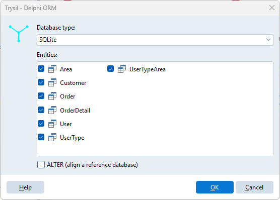
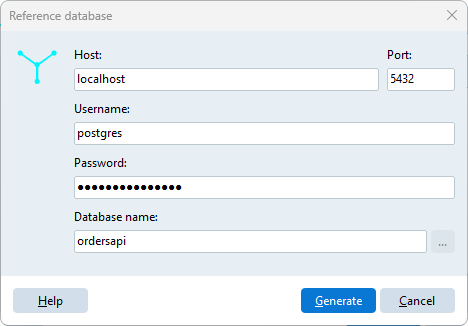

# Generate DDL script

**Trysil > Generate DDL script** writes an SQL script from the model. It works in two ways:

- **CREATE**, the default: the script creates sequences, tables and indexes from scratch, for a new database;
- **ALTER**: the Expert reads an existing database, the *reference database*, compares it with the model and writes only the statements that are missing.

The Expert never runs the script: it saves it to a file, and you review it and run it with the tool you use for your database.

## The dialog



| Field | Meaning |
|---|---|
| Database type | Firebird SQL, InterBase, MariaDB, Oracle, PostgreSQL, SQL Server, SQLite |
| Entities | The entities to include, all ticked by default. Right click for **Select all entities** / **Unselect all entities** |
| ALTER (align a reference database) | Compare with an existing database instead of creating from scratch |

Click **OK**, then choose where to save the `.sql` file. The database type is remembered for the project.

## CREATE script

For each selected entity the script contains, in this order:

1. the sequence of the primary key (except on SQLite, which has none);
2. the table, with its columns and the primary key constraint;

and at the end one index for each entity list column, on the column of the detail table, named `IDX_<Table>_<Column>`.

```sql
CREATE SEQUENCE OrdersID START 1;

CREATE TABLE Orders(
  ID integer NOT NULL,
  OrderDate timestamp NOT NULL,
  CustomerID integer NOT NULL,
  Notes varchar(200) NULL DEFAULT '',
  VersionID integer NOT NULL,
  PRIMARY KEY (ID)
);

CREATE INDEX IDX_Orders_CustomerID ON Orders (CustomerID);
```

Columns that are not **Required** are `NULL`; a `String` with **Allow empty** gets `DEFAULT ''`. Entity columns are integer columns. Foreign key constraints are not generated.

## ALTER script

Tick **ALTER (align a reference database)** and click **OK**. The Expert asks for the connection to the reference database:



| Field | Used for |
|---|---|
| Host | Server databases |
| Port | MariaDB, Oracle and PostgreSQL; `0` means the default port |
| Username, Password | Server databases |
| Database name | The database; for Oracle the service name; for SQLite the file, chosen with the **...** button |

Click **Generate**: the Expert connects with FireDAC, reads the tables of the selected entities, and then asks where to save the script. The connection parameters, **except the password**, are remembered for the project.

The ALTER script only **adds**:

| In the model, missing in the database | Statement |
|---|---|
| Table | `CREATE SEQUENCE` and `CREATE TABLE`, as in the CREATE script |
| Sequence of an existing table | `CREATE SEQUENCE` |
| Column | `ALTER TABLE ... ADD` |
| Index of an entity list column | `CREATE INDEX`, when no index starts with that column |

It never drops or alters anything. A column added to an existing table is always created `NULL`, even when the model says it is required, because the table may already have rows. In that case the script adds a reminder:

```sql
ALTER TABLE Orders ADD COLUMN DeliveryDate timestamp NULL;
-- Orders.DeliveryDate is required: fill it, then make it NOT NULL
```

Differences the Expert does not fix, a different type, a different length of a `String`, a different nullability, are listed as comments at the top of the script, so you can decide what to do with them:

```sql
-- Differences not aligned by this script:
-- Customers.Name: model varchar(100), database varchar(50)
-- Customers.Email: model NOT NULL, database NULL
```

When the database already matches the model, the script contains only `-- The database is already aligned with the model.`

Tables, columns and sequences that are in the database but not in the model are ignored.

!!! note "SQL Server and Oracle"
    Reading a SQL Server or Oracle database requires the FireDAC drivers of the Enterprise or Architect edition of Delphi. On Community and Professional the Expert is built without them, and choosing ALTER with one of those two database types gives *The ... driver is not included in this build of Trysil Expert*. The CREATE script works for every database type in every edition.

## Data types by database

| Model type | Firebird | InterBase | MariaDB | Oracle | PostgreSQL | SQL Server | SQLite |
|---|---|---|---|---|---|---|---|
| Primary key, Version, Integer, Entity | `INTEGER` | `INTEGER` | `INT` | `NUMBER(9)` | `integer` | `int` | `INT` |
| String | `VARCHAR(n)` | `VARCHAR(n)` | `VARCHAR(n)` | `VARCHAR2(n)` | `varchar(n)` | `nvarchar(n)` | `NVARCHAR(n)` |
| Memo | `BLOB` | `BLOB SUB_TYPE 1` | `TEXT` | `CLOB` | `varchar` | `nvarchar(max)` | `TEXT` |
| Smallint | `SMALLINT` | `SMALLINT` | `SMALLINT` | `NUMBER(5)` | `smallint` | `smallint` | `SMALLINT` |
| LargeInteger | `BIGINT` | `NUMERIC(18,0)` | `BIGINT` | `NUMBER(19)` | `bigint` | `bigint` | `BIGINT` |
| Double | `FLOAT` | `DOUBLE PRECISION` | `DECIMAL(18,4)` | `NUMBER(18,4)` | `decimal` | `float` | `DOUBLE` |
| Currency | `DECIMAL(18,4)` | `DECIMAL(18,4)` | `DECIMAL(19,4)` | `NUMBER(19,4)` | `decimal(19,4)` | `decimal(19,4)` | `DECIMAL(19,4)` |
| Boolean | `BOOLEAN` | `BOOLEAN` | `BOOLEAN` | `NUMBER(1)` | `boolean` | `bit` | `BOOLEAN` |
| DateTime | `TIMESTAMP` | `TIMESTAMP` | `DATETIME` | `TIMESTAMP` | `timestamp` | `datetime2` | `DATETIME` |
| Guid | `CHAR(16) CHARACTER SET OCTETS` | `CHAR(16) CHARACTER SET OCTETS` | `CHAR(38)` | `RAW(16)` | `uuid` | `uniqueidentifier` | `GUID` |
| Blob | `BLOB` | `BLOB SUB_TYPE 0` | `BLOB` | `BLOB` | `bytea` | `varbinary(max)` | `BLOB` |
