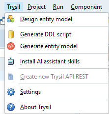

# Trysil Expert

The Trysil Expert is a Delphi IDE add-in that designs your entity model visually and generates code and SQL from it. You design entities and their columns once, then the Expert writes:

- the **entity units**, Delphi classes with Trysil attributes;
- the **DDL script** that creates the tables, for seven database dialects, or the **ALTER script** that brings an existing database up to date with the model;
- for API REST projects, a **controller** for each entity, registered in the server.

It also creates new **API REST projects** from a ready-made template, and installs the [AI assistant skills](../ai-skills.md) in your project.

## Installation

The Expert is a DLL project of its own, not one of the Trysil packages. Build it and register it in the IDE as described in [Installation](../../getting-started/installation.md#expert-installation-optional).

## The Trysil menu

Once installed, the Expert adds a **Trysil** menu to the IDE main menu, just before **Project**:



| Command | What it does | Needs an open project |
|---|---|---|
| [Design entity model](design.md) | Opens the visual designer for entities and columns | Yes |
| [Generate DDL script](generate-sql.md) | Writes the CREATE script, or the ALTER script from a reference database | Yes |
| [Generate entity model](generate-model.md) | Writes the entity units, and optionally their rules units and the API REST controllers | Yes |
| [Install AI assistant skills](../ai-skills.md) | Writes the AI assistant skills into the project | Yes |
| [Create new Trysil API REST](api-rest.md) | Creates a new API REST project from the template | No, only when **no** project is open |
| [Settings](settings.md) | Default folders and unit names | Yes |
| About Trysil | Version and license | No |

The same commands are also on the **Trysil** toolbar.

## Where the model is saved

The model belongs to the project and lives next to it, in a folder named `__trysil` by default:

```
MyProject\
  MyProject.dproj
  __trysil\
    customer.json        one file per entity
    order.json
    __settings\
      settings.json      choices made in the Expert dialogs for this project
```

Each entity is a small JSON file named after the entity, in lower case. Add the `__trysil` folder to version control together with the project: it is the source of truth for everything the Expert generates.

`settings.json` remembers what you chose the last time in each dialog (model folder, unit names, database type, reference database). It is created the first time you confirm one of the generation dialogs.

!!! note
    The model is the source, the generated units are output. When you need a change, make it in the designer and generate again rather than editing the units by hand: the next generation overwrites them.

## Typical workflow

1. Open or create your Delphi project.
2. **Trysil > Design entity model**: add entities and their columns, then **Save**.
3. **Trysil > Generate DDL script**: choose the database type and save the script. Run it on your database.
4. **Trysil > Generate entity model**: the entity units are created and added to the project.
5. When the model changes, repeat from step 2. For an existing database, tick **ALTER** in step 3 to get only the statements that are missing.
