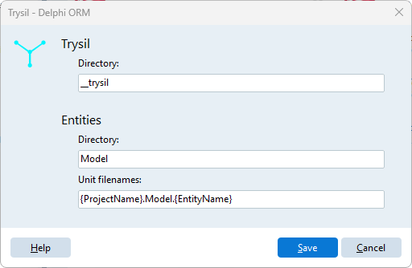

# Settings

**Trysil > Settings** sets the defaults of the Expert. They are saved for your Windows user, in the registry under `HKEY_CURRENT_USER\SOFTWARE\Trysil\Expert`, and apply to every project.

| Group | Field | Default | Meaning |
|---|---|---|---|
| Trysil | Directory | `__trysil` | Folder, relative to the project, where the entity model is saved |
| Entities | Directory | `Model` | Default folder of the generated entity units |
| Entities | Unit filenames | `{ProjectName}.Model.{EntityName}` | Default pattern of the unit names |

## Defaults and project settings

**Entities > Directory** and **Unit filenames** are only the starting values. The first time you confirm [Generate entity model](generate-model.md) in a project, the values in that dialog are saved with the project, in `__trysil\__settings\settings.json`, and from then on the project uses its own values: changing the settings later does not affect it.

**Trysil > Directory** is different: it is read every time, for every project. If you change it, the Expert looks for the model of all your projects in the new folder, so set it once, before you start, and leave it.
